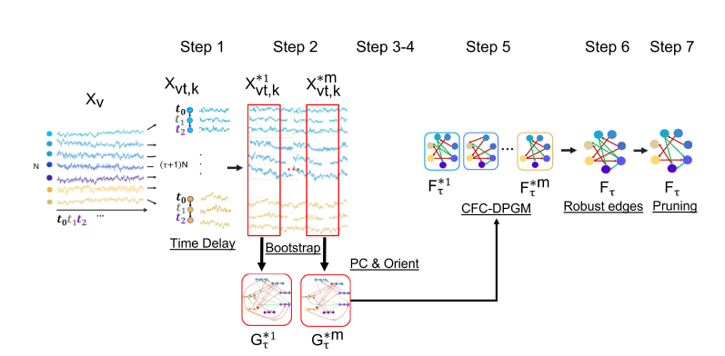
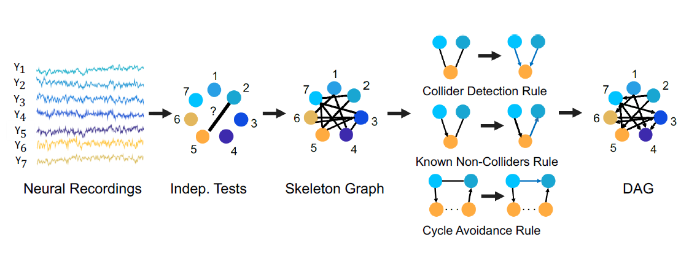
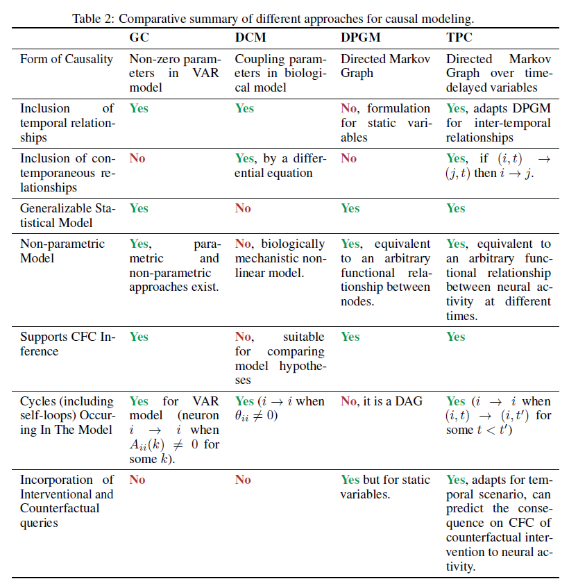

===========
Methodology
===========

Time-Aware PC Algorithm
-----------------------

TPC estimates the Causal Functional Connectivity (CFC) from time series observations using recent developments in Directed Probabilistic Graphical Modeling. :cite:`biswasshlizerman2022-2`.

.. image:: TPC_algo.png
   :width: 500

PC Algorithm
------------

PC is an algorithm for causal inference from static data, that is based on independent and identically distributed observations. :cite:`kalishbuhlmann`,:cite:`biswasshlizerman2022-2`.

Granger Causality
-----------------

Granger causality (GC) is a statistical methodology for determining whether one time series is useful in predicting another :cite:`granger1969investigating`,:cite: `basu2015network`.

Comparison of Approaches
------------------------
